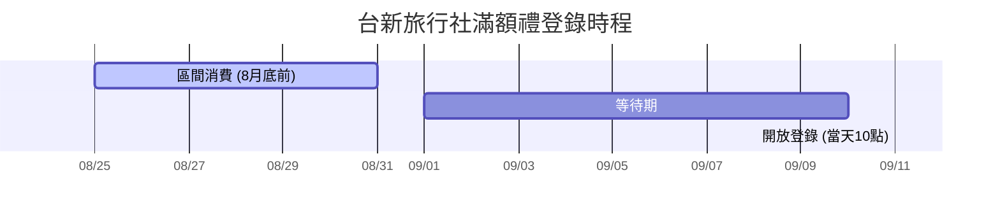

---
{"dg-publish":true,"dg-path":"✈️ 山富旅遊刷卡回饋.md","permalink":"/✈️ 山富旅遊刷卡回饋/","dg-note-properties":{}}
---

# ✈️ 2027冰島自駕機票：台新 Richart 卡消費最優化筆記

> [!IMPORTANT] **刷卡前置防呆檢查（必須全部符合）**
> 1. 方案必須手動切換至 **「玩旅刷」**。
> 2. 必須已綁定 **Richart 帳戶自動扣繳卡費** 且生效（未綁定回饋將縮水至 1.3%）。
> 3. 必須選擇 **「單筆全額刷清」**，切勿使用 0 利率分期（分期將無法取得 3.3% 回饋）。

---

## 📊 1. 預估刷卡金額與回饋試算
*   **預計消費通路：** 山富旅遊官網（一本票：KHH 經 HKG、ZRH 至 KEF）
*   **刷卡目標金額：** 新台幣 **147,032 元** (4人機票總額)

### 💰 回饋收益明細表

| 回饋項目 | ％ 數 / 點數 | 預估獲得回饋 | 備註說明 |
| :--- | :--- | :--- | :--- |
| **玩旅刷基本加碼** | `3.3%` | **4,852 點** | 計算：$147,032 \times 3.3\% = 4852.056$（小數點無條件捨去）。 |
| **旅行社單月滿額禮**| `1.7%` 換算 | **600 點** | 消費已達 35,000 元門檻，**需於指定時間手動登錄**。 |
| **預估總回饋** | **約 3.7%** | **5,452 點** | 台新 Point (信用卡)，總價值約新台幣 5,452 元。 |

---

## 🔒 2. 權益天花板與限額防禦機制
*   **加碼限額公式：** `個人永久信用額度 + NT$300,000`。
*   **實測情境：** 本次實際刷卡 **147,032 元**。只要您的個人永久固定額度高於 0 元，加計 30 萬後的安全水位必大於 14.7 萬。因此本筆消費 **全額皆能穩拿 3.3% 回饋**，安全未爆上限。
*   **特別注意：** 玩旅刷與「切換刷」、「保費加碼」共用此 30 萬加碼額度上限。

---

## ⏰ 3. 重要登錄時程與搶點設定
旅行社滿額加碼禮為 **限量 500 份**，採取「先登錄先贏」機制，務必設定手機鬧鐘。

*   **消費認列區間：** 115/08/01 - 115/08/31（即日起至月底前刷卡皆符合）
*   **開放登錄時間：** **115/09/11 (五) 10:00 - 23:59**
*   **登錄管道：** Richart Life APP 任務牆 或 台新銀行官網登錄專區。

---

## 🧳 4. 後續行程與出入境防呆備忘
*   **一本票優勢：** 山富開立聯程一本票，享失接與延誤免費改簽保障。高雄出發務必確認 **行李直掛冰島 (KEF)**。
*   **免稅威士忌規則：** 香港可買威士忌，必須請店員用 **紅條防拆密封袋 (STEB)** 封好，**嚴禁在機上開瓶飲用**（機上可免費向空服員點酒）。
